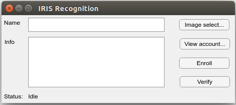
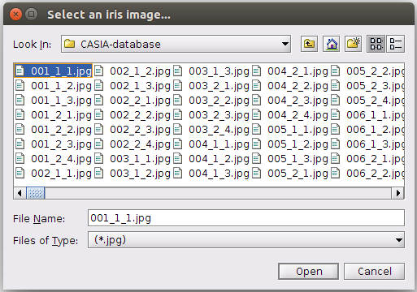
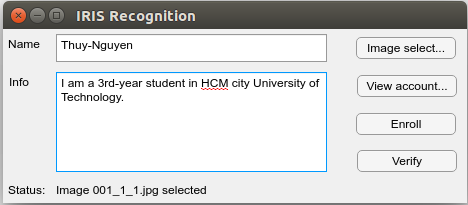
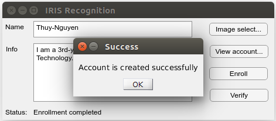
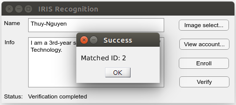
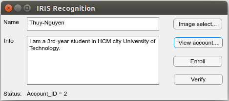

# Iris Recognition

I build an `Iris-Recognition system`, implemented on both Matlab and Python languages.
#### Keyword: Iris Recognition, Computer Vision, Image Processing, Daugman


Table of contents
=================
- [Iris Recognition](#iris-recognition)
- [Table of contents](#table-of-contents)
- [I.Introduction](#iintroduction)
- [II.Description](#iidescription)
- [III.Prerequisites](#iiiprerequisites)
- [IV.Folder structure](#ivfolder-structure)
- [V.MATLAB implementation](#vmatlab-implementation)
- [VI.Python implementation](#vipython-implementation)
- [VII.Result](#viiresult)


I.Introduction
==============
* In the last summer 2017, I met my teacher in the course Digital Signal Processing. He recommended me Biometrics topic. Since there, I have started exploring about Biometrics, such as Fingerprint, Iris, and Face.
* I searched on the Internet and found out an open-source Iris Recognition model, which written on Matlab. Thanks to the author of this open-source code, I can build up my own system. [Here is information about the author](http://www.peterkovesi.com/studentprojects/libor/sourcecode.html):\
``
Libor Masek, Peter Kovesi. MATLAB Source Code for a Biometric Identification System Based on Iris Patterns. The School of Computer Science and Software Engineering, The University of Western Australia. 2003.
``
* Based on this available functions, I have modified, connected, and designed my individual system on Matlab. Subsequently, I have also converted Matlab version into Python one.
* My contribution is creating a GUI so that user can use this as a convenient software. Moreover, in my modified system, I utilized hardware to boost the runtime performance to make is faster, comparing to the original version.
* The testing experiment shows that these two forms had fairly equal accuracy. In addition, because of the C++ platform, Matlab implementation seems faster a little bit than Python.


II.Description
==============


III.Prerequisites
=================
* Because I write the GUI using App designer, and only update versions of Matlab (from R2016a) have this feature. Therefore, to be able to run code, your Matlab version must be R0216a or higher.


IV.Folder structure
===================
<!-- AUTO-GENERATED-CONTENT:START (DIRTREE:dir=./&depth=1) -->
```
.
+-- CASIA-database/
|   +-- 001_1_1.jpg
|   +-- ...
|   +-- 108_2_4.jpg
|
+-- matlab/
|   +-- fnc/
|       +-- addcircle.m
|       +-- ...
|   +-- template-database/
|       +-- 1.mat
|       +-- ...
|   +-- IrisRecognitionGUI.mlapp
```
<!-- AUTO-GENERATED-CONTENT:END -->
* Folder `CASIA-database` includes original eye images. My system will use images in this folder as the input.
* Folder `matlab` is the implementation on Matlab language. In which, folder `fnc` contains back-end functions for the GUI. Folder `template-database` stores registered template extracted from eye images. File `IrisRecognitionGUI.mlapp` is the GUI configuration for my system.


V.MATLAB implementation
=======================
* The picture below is the GUI of MATLAB.
* There are 3 modes: `Enrollment`, `Verification`, and `Account infomation view`. `Enrollment` means register an account template to the database so that you can verify a different eye image belongs to who in the database in the `Verification` mode. All account templates are anonymous that the name of template file doesn't reveal who owns it. Therefore, `Account infomation view` can be used to see the information inside a template file.

<p align="center">
  
</p>

V.1.Enrollment:
---------------
* Select button `Image select...`, a select browser will appear for you to select an eye image for enrollment.

<p align="center">
  
</p>

* Then, input the name and basic information that you want to store. Afterward, click button `Enroll`.

<p align="center">
  
</p>

* A message show will notify that the enrollment is successful.

<p align="center">
  
</p>

* At this time, I haven't develop a feature to reject accounts that exist in the database. In the future, I will fill into this blank.

V.2.Verification:
-----------------
* To verify an eye image to see who is is, click button `Image select...` to select an image as instructions in the `Enrollment` section.
* Click button `Verify`. Then, a message notify the verification state. In addition, information about the matched account will be shown as the following picture.

<p align="center">
  
</p>

V.3.Account infomation view:
----------------------------
* Click button `View account...` to select the template file that you hope to see its content. The result will be same as the picture below.

<p align="center">
  
</p>


VI.Python implementation
========================


VII.Result
==========
Hardware board:


Hardware board connected to home electric network:


Mode test (Test handy and automatic modes):  
https://youtu.be/6kZmtNLPiIU

Alarm tests (On and Off alarm):  
https://youtu.be/Bq2uVIg-Ajc  
https://youtu.be/PRSb5gKpI5M  
